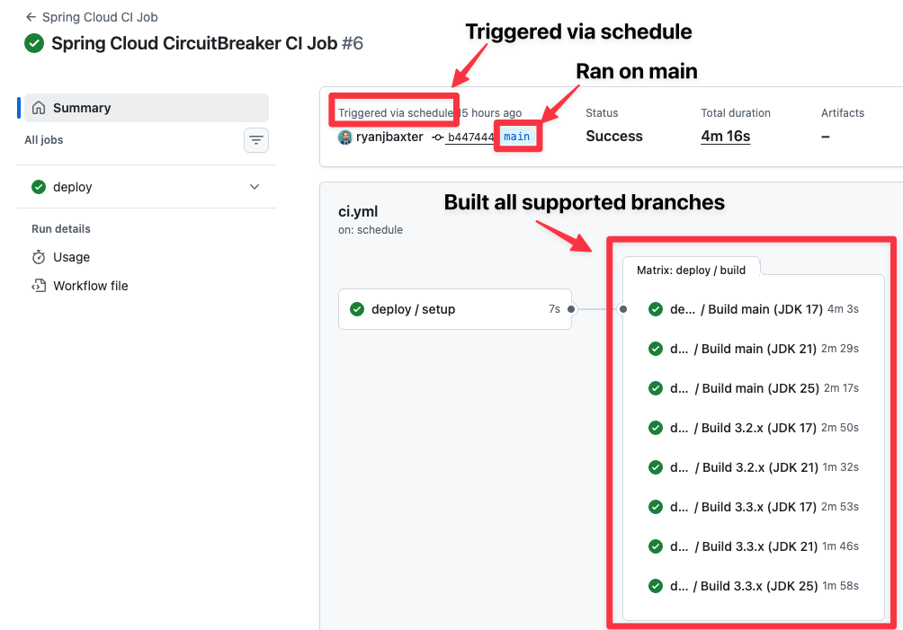

# Deploy Workflow

A reusable GitHub Actions workflow for building and deploying Spring Cloud projects. It uses centralized configuration to determine which branches and JDK versions to build, then runs Maven with the appropriate profiles for each matrix combination.

## Description

The workflow is designed to be called from Spring Cloud project repositories via `workflow_call`. It:

- **Determines the build matrix** using the [determine-matrix](../actions/determine-matrix/README.md) action and [`config/projects.json`](../../config/projects.json), supporting both OSS and commercial repository variants
- **Builds each branch × JDK combination** in parallel with a matrix strategy
- **Deploys artifacts and docs** only for designated JDK versions (e.g., JDK 8 when present, otherwise JDK 17), while other JDK versions run `install` only
- **Supports custom build commands** so callers can override the default Maven behavior

The workflow configures Maven settings for Artifactory (OSS and optional commercial), checks out the correct branch, sets up the JDK, and runs either the default Maven deploy/install or a custom command.

## Requirements

- The calling repository must use Maven with a `mvnw` wrapper
- Required secrets must be configured in the calling repository (or passed from the caller)

## Inputs

| Input | Description | Required | Type |
|-------|-------------|----------|------|
| `branches` | Branch(es) to build — single branch or comma-separated list (e.g. `main,3.3.x,3.2.x`). Empty uses ref or scheduled config. | No | string |
| `custom_build_command` | Custom run command for the build step (overrides default Maven command). Supports multi-line. | No | string |
| `runs_on` | Runner to use for the build job. | No | string (default: `ubuntu-latest`) |

## Secrets

| Secret | Description | Required |
|--------|-------------|----------|
| `ARTIFACTORY_USERNAME` | Username for OSS Artifactory (repo.spring.io) | Yes |
| `ARTIFACTORY_PASSWORD` | Password for OSS Artifactory | Yes |
| `COMMERCIAL_ARTIFACTORY_USERNAME` | Username for commercial Artifactory | No (required for *-commercial repos) |
| `COMMERCIAL_ARTIFACTORY_PASSWORD` | Password for commercial Artifactory | No (required for *-commercial repos) |
| `DOCKERHUB_USERNAME` | Docker Hub username | Yes |
| `DOCKERHUB_TOKEN` | Docker Hub token | Yes |

## How It Works

1. **Setup job**: Runs the [determine-matrix](../actions/determine-matrix/README.md) action to produce a matrix of `branch`, `java-version`, and `has-jdk8` from [`config/projects.json`](../../config/projects.json).
2. **Build job** (matrix): For each matrix entry:
   - Checkout the branch, set up the JDK, configure Maven and Docker Hub
   - Decide whether this combination should deploy (and use the docs profile) based on `has-jdk8` and `java-version`
   - Run either:
     - **Build**: `./mvnw clean install -Pspring -B -U` when not deploying
     - **Build and deploy**: `./mvnw clean deploy -Pdocs,deploy,spring -B -U` for the designated deploy JDK
     - **Custom build command**: The caller-provided command, if set

Deploy and docs are enabled for one JDK per branch (JDK 8 if the branch has JDK 8, otherwise JDK 17).

## Usage

### Basic usage from a Spring Cloud repo

In your project’s `.github/workflows/ci.yml`:

```yaml
jobs:
  deploy:
    uses: spring-cloud/spring-cloud-github-actions/.github/workflows/deploy.yml@main
    with:
      branches: ${{ inputs.branches }}
      runs_on: ${{ inputs.runs_on }}
    secrets:
      ARTIFACTORY_USERNAME: ${{ secrets.ARTIFACTORY_USERNAME }}
      ARTIFACTORY_PASSWORD: ${{ secrets.ARTIFACTORY_PASSWORD }}
      DOCKERHUB_USERNAME: ${{ secrets.DOCKERHUB_USERNAME }}
      DOCKERHUB_TOKEN: ${{ secrets.DOCKERHUB_TOKEN }}
```

For commercial projects, also pass `COMMERCIAL_ARTIFACTORY_USERNAME` and `COMMERCIAL_ARTIFACTORY_PASSWORD`.

#### Triggering The Workflow

You can trigger the workflow from a variety of events.  Most repos will want to trigger the workflow on pushes, a schedule, and a manual trigger.

```yaml
on:
  push:
    branches:
      - main
      # other supported branched
      - 4.3.x
      - 4.2.x

  # Scheduled builds run daily at midnight UTC
  schedule:
    - cron: '0 0 * * *'

  # Manual trigger with optional branch override
  workflow_dispatch:
    inputs:
      branches:
        description: "Which branch should be built (can be a comma-separated list of branches)"
        required: true
        default: 'main'
        type: string
```

There are a few things to note about how the schedule and push triggers work on GitHub.

##### Scheduled Triggers

**Scheduled triggers only get triggered from the repo's default branch.**
This means that if `main` is the default branch in your repo and you have the configuration above setup in your workflow, that there will not be any scheduled execution on the 4.3.x. and 4.2.x branches.  The `deploy.yaml` in this repo takes that into account.  When your workflow is triggered to run via a schedule event `deploy.yaml` will setup the matrix to build all supported branches configured in the projects.json.  When you look at the workflow in the GitHub Actions UI you will see something that looks like this for scheduled executions.



Notice the workflow was triggered via a scheduled event, ran on the `main`
branch (which is the default branch in this repo) but it checked out and built all supported branches for this repo (determined via `projects.json`).

##### Push Triggers

Given that scheduled triggers only execute on the default branch and we can build all the other branches from the default branch it might not seem necessary to have a workflow on the other supported branches in the repo.  Unfortunately for push events the workflow needs to be present on the branch the push event occurred in order for it to execute.  **If you want to build and deploy your snapshots on push events to branches other than the default branch your workflow also needs to be in the `.github/workflows` folder on those branches.**

### Example caller workflow

A full example with `push`, `schedule`, and `workflow_dispatch` (including optional `branches` and `runs_on`) is in [examples/deploy.yml](../../examples/deploy.yml). Copy and adapt that file into your project’s `.github/workflows/deploy.yml`.

### Custom build command

To override the default Maven command:

```yaml
with:
  branches: ${{ inputs.branches }}
  custom_build_command: |
    if [[ "$SHOULD_DEPLOY" == "true" ]]; then
      ./mvnw clean deploy -Pdocs,deploy,spring -B -U
    else
      echo "Will not deploy artifacts"
    ./mvnw clean install -Pspring -B -U
    fi
```
When using a custom_build_command there is an environment variable named `SHOULD_DEPLOY` which indicates that the JDK being used is the one we should deploy snapshots from (currently JDK 8 if supported or JDK 17).  This is also the JDK
we should use to build docs.  This is why in the snippet above we call the `deploy` goal and add the `docs` and `deploy` profiles when `SHOULD_DEPLOY` is true.

## Configuration

Branch and JDK version behavior is driven by [config/projects.json](../../config/projects.json) and the [determine-matrix](../actions/determine-matrix/README.md) action. The workflow does not define branches or JDK versions itself; it only consumes the matrix produced by that action.

## See also

- [Determine Build Matrix action](../actions/determine-matrix/README.md) — builds the matrix from `config/projects.json`
- [Example caller workflow](../../examples/deploy.yml) — ready-to-adapt workflow for Spring Cloud projects
