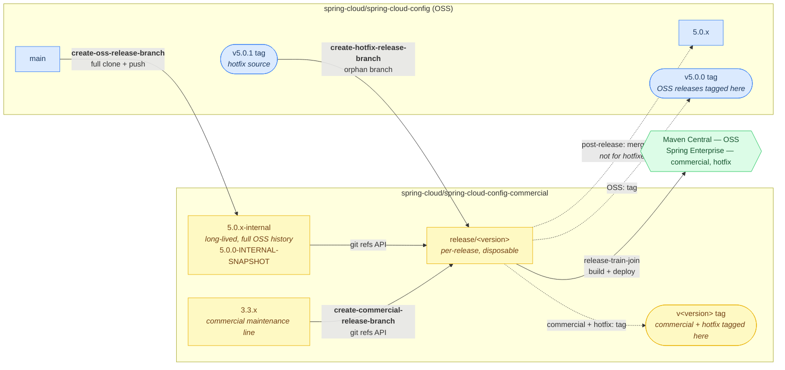
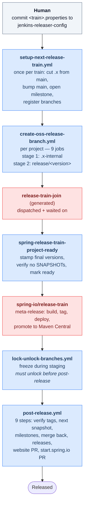
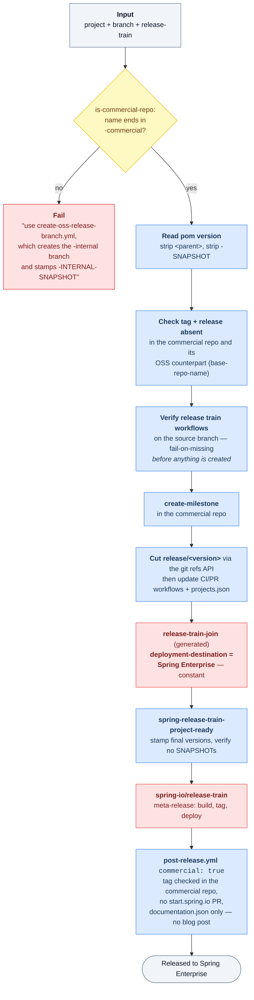

# How Spring Cloud Releases Work

A guide to the automation in this repository, for people who know Spring Cloud release trains,
BOMs, and Artifactory, but do not yet know how this repo drives them.

The [README](../README.md) is a catalogue — every workflow and action, one row each. This
document is the connective narrative it does not have: what happens, in what order, and where
the seams are.

## Contents

- [The one thing to know first](#the-one-thing-to-know-first)
- [What this repository is](#what-this-repository-is)
- [The boundary: what this repo does *not* do](#the-boundary-what-this-repo-does-not-do)
- [Repository and branch model](#repository-and-branch-model)
  - [Merging a release line forward](#merging-a-release-line-forward)
- [Where version numbers come from](#where-version-numbers-come-from)
- [The OSS release, end to end](#the-oss-release-end-to-end)
- [The commercial release, and how it differs](#the-commercial-release-and-how-it-differs)
- [Hotfixes](#hotfixes)
- [Which actions each workflow uses](#which-actions-each-workflow-uses)
- [Everything else this repo runs](#everything-else-this-repo-runs)
- [This repository's own versioning](#this-repositorys-own-versioning)
- [Conventions](#conventions)
- [Seams and open questions](#seams-and-open-questions)

---

## The one thing to know first

**Both OSS and commercial releases are built in the commercial repository.**

For every project, the `release/<version>` branch exists only in
`spring-cloud/<project>-commercial` — never in the OSS repo. It is cut from a long-lived
`<major>.<minor>.x-internal` branch, which is itself a full-history copy of the OSS branch
pushed into the commercial repo.

So an "OSS release" is not built on OSS infrastructure. It is built on commercial
infrastructure and *published* to Maven Central.

### Three release types, three workflows

Every release starts by cutting a `release/` branch in the commercial repo, and which workflow
you run depends on what you are releasing. These three are the entry points to everything in
this document:

| | **OSS** | **Commercial** | **Hotfix** |
|---|---|---|---|
| **Entry point** | [`create-oss-release-branch.yml`](../.github/workflows/create-oss-release-branch.yml) | [`create-commercial-release-branch.yml`](../.github/workflows/create-commercial-release-branch.yml) | [`create-hotfix-release-branch.yml`](../.github/workflows/README-create-hotfix-branch.md) |
| **Cut from** | an OSS branch (`main`, `5.0.x`) | a commercial branch (`3.3.x`) | an OSS **tag** (`v5.0.1`) |
| **Via** | a long-lived `<major>.<minor>.x-internal` branch, full OSS history | nothing — same repo already | an orphan branch, no history |
| **Release branch** | `release/5.0.0` | `release/3.3.1` | `release/5.0.1.1` — always a `.1` suffix |
| **Published to** | Maven Central | Spring Enterprise | Spring Enterprise |
| **Versions stamped** | `-INTERNAL-SNAPSHOT`, final numbers at ready | untouched until ready | `<current>.1-SNAPSHOT` immediately |
| **Tag + milestone** | **OSS** repo | **commercial** repo | **commercial** repo |
| **`post-release`** | all nine steps | nine, with `commercial: true` | steps 1, 2, 6, 7 only |

All three converge on the same machinery once the branch exists: `release-train-join` is
dispatched, [`spring-release-train-project-ready`](../.github/actions/spring-release-train-project-ready/)
stamps the final versions, the external release train builds and tags, and
[`post-release`](../.github/workflows/README-post-release.md) does the chores. Everything that
differs is in the table above.



Because the tagged commit for an OSS release lives on a branch in the *commercial* repo, it is
unreachable history in the OSS repo until the merge-back happens. That is why `post-release`
merges (step 5) before it generates release notes from the tag (step 6) — see the header
comment at [`post-release.yml:33-42`](../.github/workflows/post-release.yml).

---

## What this repository is

A **control plane**. It hosts no product code. It contains:

- **Reusable workflows** (`.github/workflows/`) consumed by other repos via
  `uses: spring-cloud/spring-cloud-github-actions/.github/workflows/deploy.yml@<sha>`
- **Composite actions** (`.github/actions/`, ~32 of them) — the building blocks those workflows
  and the release workflows call
- **[`config/projects.json`](../config/projects.json)** — the single source of truth for which
  branches exist and which JDKs they build on, for 18 projects across OSS and commercial
- **[`config/release-train-actions/`](../config/release-train-actions/README.md)** — per-project
  and per-branch overrides copied into commercial repos by the workflow generator

Each Spring Cloud project has two repositories: the OSS repo (`spring-cloud-config`) and its
commercial twin (`spring-cloud-config-commercial`). Both consume workflows from here.

---

## The boundary: what this repo does *not* do

**This repository does not publish artifacts.** It orchestrates branches, versions, and
metadata *around* an external release engine. Getting this boundary right matters, because
roughly half of the release is not in this repo at all.

| Layer | Owned by | What it does |
|---|---|---|
| Branch / version / metadata orchestration | **this repo** | Cuts branches, stamps `pom.xml` and `gradle.properties` versions, opens and closes milestones, merges branches back, verifies tags, publishes GitHub Releases, opens website and start.spring.io PRs, freezes branches |
| The generated CI in each project repo | external `github-actions-workflow-generator` JAR | Produces `release-train-{join,build,test,ready,leave}.yml` in each target repo |
| The Maven build itself | this repo's [`release-train-build`](../.github/actions/release-train-build/action.yml) / [`release-train-test`](../.github/actions/release-train-test/action.yml) action *bodies* | `./mvnw --settings release-train-settings.xml clean deploy -P releaseTrain -DaltDeploymentRepository=release-train::default::file://$(pwd)/deployment-repository` — deploys to a **local file-based staging repo**, not to Artifactory over HTTP |
| Meta-release orchestration, dependency ordering, staging, signing, promotion to Maven Central, JFrog release bundles | external **`spring-io/release-train`** | Not documented here or anywhere in this repository — see below |

The `release-train-*.yml` workflows in each project repo are **generated, not authored here**.
This repo supplies only the *bodies* of the build and test actions they call, plus the
generator's configuration ([`config/release-train-actions/workflow-generator.yml`](../config/release-train-actions/workflow-generator.yml)).

**What `spring-io/release-train` actually does is not documented in this repository.** Once
`release-train-join` is dispatched, the dependency ordering, the staging, the signing, the
promotion to Maven Central and the JFrog release bundles all happen in a system this repo only
talks to over `workflow_dispatch`. If a release fails between the join and the tag appearing,
nothing here will tell you why.

In short: this repo *starts* the release and *cleans up after* it. The release itself runs
elsewhere, in a system documented elsewhere — or not at all.

---

## Repository and branch model

| Name | Where | Lifetime | Purpose |
|---|---|---|---|
| `main` | OSS repo | permanent | OSS development |
| `<major>.<minor>.x` (`5.0.x`) | OSS repo | permanent | OSS maintenance line, cut from `main` at train rollover |
| `<major>.<minor>.x-internal` (`5.0.x-internal`) | **commercial** repo | one per minor line | Full-history copy of the OSS branch; versions stamped `-INTERNAL-SNAPSHOT`. Created once, re-stamped for each release in the line. Registered in `projects.json`; removed only by `retire-branch.yml` |
| `release/<version>` (`release/5.0.0`) | **commercial** repo | one per release, disposable | Where the release is actually built. Registered in `projects.json` only when there is no `-internal` branch shadowing it — see [scheduled builds](#which-branch-gets-the-scheduled-build) |
| `docs-build` | both | permanent | Carries the Antora docs build workflow and playbook. Not in `projects.json` |
| `jenkins-releaser-config` | `spring-cloud-release-commercial` | permanent | Holds every version properties file — for OSS trains too |
| `<project>-commercial` | — | — | Repo naming convention, not a branch |

Two `-internal`s that are easy to confuse:

- `5.0.x-internal` is a **branch name**.
- `5.0.0-INTERNAL-SNAPSHOT` is a **Maven version string**.

The branch hosts a project stamped with that version. They are related by convention, not by
any code that derives one from the other.

---

## Where version numbers come from

Every version in every release traces back to properties files on **one branch of one repo**:

```
spring-cloud/spring-cloud-release-commercial @ jenkins-releaser-config
```

This is true for OSS trains as well as commercial ones — a common surprise, given the repo name.
The branch name is a leftover from the [deprecated `releaser`
process](spring-cloud-release-process.md); the files on it are current and load-bearing, and
nothing about the old flow survives except the name.

**Format** — one line per project:

```properties
releaser.fixed-versions[spring-cloud-config]=5.0.0
releaser.fixed-versions[spring-cloud-commons]=5.0.0
releaser.fixed-versions[spring-boot]=4.0.0
```

**Filename derivation** — the train version, dots to underscores, lowercased suffix:

| Train version | Properties file |
|---|---|
| `2025.1.2` | `2025_1_2.properties` |
| `2026.1.0-SNAPSHOT` | `2026_1_0-snapshot.properties` |
| `2026.1.0` (internal stamping) | `2026_1_0-internal-snapshot.properties` |

Three file families, which never overlap:

- `<train>.properties` — GA versions. Read by `post-release`, `update-versions`.
- `<train>-snapshot.properties` — next development versions. Read by `setup-next-release-train`,
  written by `post-release`.
- `<train>-internal-snapshot.properties` — `-INTERNAL-SNAPSHOT` versions. Read only by
  `create-oss-release-branch` when stamping a new `-internal` branch.

**One action applies them all**:
[`update-project-versions`](../.github/actions/update-project-versions/) fetches the properties
file over `raw.githubusercontent.com`, parses the `releaser.fixed-versions[...]` lines,
auto-detects the project's own name from `pom.xml`'s `<artifactId>`, and rewrites both the
project's own version and its dependency versions across `pom.xml`, `gradle.properties`, and
`build.gradle`. It supports `project-version-substitutions` for property names that do not match
their project (e.g. `verifierVersion` → `spring-cloud-contract`).

`spring-boot` appears in every properties file so projects can pick up the Boot version, but is
never treated as a releasable repo — never tagged, milestoned, or pushed to.

**Who writes these files?** A human commits the GA `<train>.properties` file. Nothing in this
repo creates it. `post-release` does write the follow-on `<train>-snapshot.properties` file
automatically.

> A separate action, [`extract-bom-versions`](../.github/actions/extract-bom-versions/), reads
> versions directly out of the BOM `pom.xml` instead. It is for ad-hoc lookups and is not part
> of the release pipeline.

---

## The OSS release, end to end



Blue is this repo. Red is external.

### Phase 0 — Train rollover (once per train)

A human commits the train's properties file to `jenkins-releaser-config`.

Then **[`setup-next-release-train.yml`](../.github/workflows/README-setup-next-release-train.md)**
rolls `main` forward across every OSS project, in one run:

1. Derive the `.x` release-line branch name from `main`'s pom version and cut it
2. [`retarget-branch-triggers`](../.github/actions/retarget-branch-triggers/) — rewrite the new
   branch's workflow triggers so they name it instead of `main`
3. [`mark-branch-merged`](../.github/actions/mark-branch-merged/) — record that retarget
   commit as merged into `main` with an `ours` merge, so merging the line forward later does
   not repoint `main`'s own workflows (see
   [Merging a release line forward](#merging-a-release-line-forward))
4. [`add-dependabot-branch-entries`](../.github/actions/add-dependabot-branch-entries/) — add
   Dependabot entries for it, editing the config on the default branch (the only place
   Dependabot reads it)
5. [`update-project-versions`](../.github/actions/update-project-versions/) — move `main` onto
   the next train's `-SNAPSHOT` versions
6. [`create-milestone`](../.github/actions/create-milestone/) — open the new line's first
   milestone (`<next>.0-M1`)
7. [`add-branches-projects-json`](../.github/actions/add-branches-projects-json/) — register
   every new branch in `projects.json` as a single commit

Defaults to a dry run that shows the diffs it would push.

### Phase 1 — Cut the release branch

**[`create-oss-release-branch.yml`](../.github/workflows/create-oss-release-branch.yml)**, run
per project. Its nine jobs, in order:

| Job | Line | What it does |
|---|---|---|
| `derive` | `:85` | Read the OSS `pom.xml`, strip `-SNAPSHOT` → `release_version`. Derive `internal_branch` = `<major>.<minor>.x-internal`, `commercial_repo` = `<oss_repo>-commercial`, `commercial_branch` = `release/<version>` |
| `create-internal-branch` | `:158` | Full-history clone of the OSS branch, pushed to the commercial repo as `<major>.<minor>.x-internal`. **Skipped if it already exists** — created once per minor line |
| `init-internal-branch` | `:196` | [`add-commercial-release-files`](../.github/actions/add-commercial-release-files/) (`ci-release.yml` + `release-ci-settings.xml`, committed `[skip actions]`), register in `projects.json`, then stamp versions to `-INTERNAL-SNAPSHOT`. Pushed **without** `[skip actions]`, so CI starts asynchronously |
| `create-release-branch` | `:267` | Cut `release/<version>` from the `-internal` tip via the git refs API — no clone. Fails if it already exists. Not registered in `projects.json`; the `-internal` branch it copies already carries the [scheduled build](#which-branch-gets-the-scheduled-build) |
| `update-release-branch` | `:306` | Re-apply the commercial CI files to the new release branch |
| `create-milestone` | `:330` | Open a milestone **in the OSS repo** |
| `ensure-workflows` | `:348` | Check the branch with [`check-release-train-workflows`](../.github/actions/check-release-train-workflows/); if anything is missing, run the external workflow generator via [`generate-workflows-for-branch`](../.github/actions/generate-workflows-for-branch/) |
| `trigger-release-train-join` | `:423` | `gh workflow run release-train-join.yml --field deployment-destination="Maven Central" ...` then `gh run watch --exit-status` — **blocks** on the external run |
| `trigger-ci` | `:457` | Squash the `[skip actions]` init commits into one and push without the marker, starting normal CI |

### Phase 2 — Per-project readiness

**[`release-train-ready.yml`](../.github/workflows/release-train-ready.yml)** is a thin wrapper
over the [`spring-release-train-project-ready`](../.github/actions/spring-release-train-project-ready/)
composite action, which for each project:

1. Validate the branch version against the `jenkins-releaser-config` properties file
2. Check out `release/<version>`
3. `update-project-versions` — stamp final, non-SNAPSHOT dependency versions
4. Delete `ci.yml`, `pr.yml`, `ci-release.yml`, `release-ci-settings.xml` from the release branch
5. [`verify-no-snapshot-versions`](../.github/actions/verify-no-snapshot-versions/) — a hard gate
   against any remaining `-SNAPSHOT`, `-RC`, or `-M` version
6. Commit and push as `spring-builds`
7. Dispatch the project's own generated `release-train-ready.yml` and wait
8. Remove the release branch from the Antora playbook via [`update-antora-playbook`](../.github/actions/update-antora-playbook/)

### Phase 3 — The meta-release (external)

`spring-io/release-train` drives the dependency-ordered meta-release across every project —
building, tagging, deploying and promoting each one in turn. That system is external to this
repository and [not documented here](#the-boundary-what-this-repo-does-not-do).

### Phase 4 — Freeze (optional)

**[`lock-unlock-branches.yml`](../.github/workflows/README-lock-branches.md)** applies a
`Release Freeze` ruleset per repository so nothing lands on `.x` / `main` while the release is
staged.

> **Unlock before running `post-release`.** The automation token has no bypass on the ruleset,
> so a still-frozen branch will fail the merge-back.

This is a different ruleset from the permanent `Locked Branches` one that `retire-branch.yml`
uses. They do not interfere.

### Phase 5 — Post-release chores

**[`post-release.yml`](../.github/workflows/README-post-release.md)**, nine steps
([`post-release.yml:15-53`](../.github/workflows/post-release.yml)):

1. **`setup`** — read the properties file, build the `{project, repo, ossRepo, commercialRepo, version, tag}` matrix
2. **`verify-tags`** — hard gate: every project version must have a `v<version>` tag (in the OSS
   repo for an OSS release, the commercial repo for a commercial one)
3. **`next-snapshot-config`** — write the next `<train>-snapshot.properties` file
4. **`new-milestones`** — open the next milestone per project
5. **`merge-back-and-update`** — merge the commercial `release/<version>` back into the OSS `.x`
   branch, bump to next-snapshot versions, push, comment `@dependabot recreate` on superseded PRs
6. **`milestones-and-releases`** — close the release milestone (inline, via a `gh api ... --method
   PATCH --field state=closed` call rather than the `close-milestone` action) and publish the
   GitHub Release with generated notes
7. **`website-pr`** — PR against `spring-io/spring-website-content`: blog post and
   `documentation.json`
8. **`start-site-pr`** — PR against `spring-io/start.spring.io` bumping the Initializr's Spring
   Cloud version (OSS only)
9. **`release-board`** + **`summary`** — roll the GitHub Project board to the next train, post a
   Google Chat report

Every mutating step is gated on existence rather than on working out whether a project was truly
part of the train — a version carried over from an earlier release already has its release and a
closed milestone, so those steps become no-ops on their own.

> **The merge-back conflicts on purpose.** The `.x` branch was bumped to the next snapshot
> before the release tags existed, so git sees divergent version lines. This is expected, not a
> failure.

**[`update-versions.yml`](../.github/workflows/README-update-versions.md)** exists to run step 5's
version bump alone, when versions must move independently of a full post-release run.

---

## The commercial release, and how it differs

A commercial release runs through
**[`create-commercial-release-branch.yml`](../.github/workflows/create-commercial-release-branch.yml)**,
which now **only** accepts a `-commercial` project and rejects anything else up front. It is much
simpler than `create-oss-release-branch.yml`: a **single job**, `join-release-train`, ten steps
after the boilerplate checkout, and no `-internal` stage at all.

That covers both kinds of commercial release, which are mechanically identical:

- **A project that also exists in OSS** — the common case. `spring-cloud-config-commercial`
  releasing its `3.3.x` line.
- **A commercial-only project** — `spring-cloud-cloudfoundry` and `spring-cloud-sleuth` have no
  OSS counterpart in `projects.json` (both legacy, `3.1.x` only).

Either way the source is a `-commercial` repo, so the destination is always Spring Enterprise —
it is now a constant in the dispatch, not a derived value.


### Inputs

| Input | Required | Notes |
|---|---|---|
| `project` | yes | Either `spring-cloud-config` or `spring-cloud-config-commercial` — the suffix is what selects the destination |
| `branch` | yes | Source branch (`main`, `4.2.x`) |
| `release-train` | yes | Spring release train to join (e.g. `2026.09`) |
| `token` | no | Falls back to `GH_ACTIONS_REPO_TOKEN` |
| `trigger-release-train-join` | no, default `true` | Uncheck to prepare the branch without joining the train |

Available as both `workflow_dispatch` and `workflow_call`.

### The ten steps

1. **Check if commercial repository** via
   [`is-commercial-repo`](../.github/actions/is-commercial-repo/), which yields `commercial` and
   `base-repo-name` (the name with `-commercial` stripped).
2. **Reject a non-commercial project** — fails when `commercial != 'true'`, explaining that every
   release is cut from the commercial repo and pointing an OSS release at
   `create-oss-release-branch.yml`, "which creates the `-internal` branch and stamps
   `-INTERNAL-SNAPSHOT` versions before cutting the release branch. This workflow does neither."
3. **Determine the release version.** Fetches `pom.xml` over the contents API and strips the
   `<parent>` block *before* matching `<version>`, so it reads the project's own version rather
   than the parent's — then strips `-SNAPSHOT`. No destination logic left here; the source is
   known to be commercial by this point.
4. **Check tag and release do not already exist** — in **both** the commercial repo and its OSS
   counterpart, resolved from `base-repo-name`, checking the git ref and the GitHub release each
   time. Any hit aborts. For a commercial-only project the OSS lookups simply come back empty,
   which reads as "not released".
5. **Verify the release train workflows exist** on the *source* branch, via
   [`check-release-train-workflows`](../.github/actions/check-release-train-workflows/) with
   `fail-on-missing: 'true'`. Deliberately placed before anything is created — see below.
6. **Create milestone** via [`create-milestone`](../.github/actions/create-milestone/) in the
   source repo, which for a commercial release is the commercial repo. (Contrast
   `create-oss-release-branch`, which puts the milestone in the OSS repo.)
7. **Create the release branch** — resolve the source branch SHA and create the ref through the
   git refs API. Source and destination are the same repo, so no clone is needed.
8. **Update CI and PR workflows** on the release branch via
   [`update-oss-workflows-to-commercial`](../.github/actions/update-oss-workflows-to-commercial/).
9. **Update `projects.json`** — registering `release/<version>`.
10. **Trigger `release-train-join` and wait** — `gh workflow run` with
    `deployment-destination=Spring Enterprise`, then `gh run watch --exit-status`, propagating
    the external run's exit code so a failed join fails this workflow.



### Three things that differ from the OSS path

**There is no `-internal` branch stage.** `create-oss-release-branch` needs one because it is
importing OSS history into the commercial repo and stamping it `-INTERNAL-SNAPSHOT`. A
commercial-sourced release is already in the right repo, so `release/<version>` is cut straight
from the source branch and no version stamping happens here at all — versions stay as they are
until `spring-release-train-project-ready` stamps the final numbers.

**It verifies the release train workflows rather than generating them.** All three
branch-creation workflows now share
[`check-release-train-workflows`](../.github/actions/check-release-train-workflows/), which holds
the single definition of what a release branch needs — `release-train-join.yml` and
`release-train-ready.yml` — and reports back through `any-missing` and `missing` outputs. What
each caller does with that answer differs:

| Workflow | On a missing file |
|---|---|
| `create-oss-release-branch` | Runs the generator to create it |
| `create-hotfix-release-branch` | Runs the generator to create it |
| `create-commercial-release-branch` | Fails, with `fail-on-missing: 'true'` |

The commercial path fails rather than generates because it has no generator step of its own, and
the check runs **before** the milestone, the branch, the workflow rewrite and the `projects.json`
commit — so a missing file stops the run while there is still nothing to clean up. The error
names each missing file and points at
[`run-github-actions-workflow-generator.yml`](../.github/workflows/run-github-actions-workflow-generator.README.md)
as the way to create them.

Where the files come from in the normal case is unchanged: `release/<version>` is cut from a
maintained branch such as `3.3.x`, which is a scheduled branch in `projects.json` and has been
through the generator, so the new branch inherits them.

**It registers the release branch in `projects.json`, where the OSS path deliberately does not**
([`create-oss-release-branch.yml:305`](../.github/workflows/create-oss-release-branch.yml) says
so explicitly). That is not an inconsistency — it follows from whether an `-internal` branch
exists to carry the build. See below.

### Which branch gets the scheduled build

`projects.json` drives the scheduled build matrix, so registering a branch there is what gives it
a daily build. The two paths register different things because they have different branches to
build:

- **OSS path.** `<major>.<minor>.x-internal` is registered and gets the scheduled build.
  `release/<version>` is cut from its tip and is an **exact copy of it** until the release branch
  is marked ready. Registering the release branch as well would run the same build twice over
  identical content, so it is deliberately left out.
- **Commercial path.** There is no `-internal` branch shadowing the release branch — it is cut
  straight from a maintenance line such as `3.3.x`, which keeps developing independently. So the
  release branch has to be registered, or nothing would build it.

The window closes at the same point in both paths.
[`spring-release-train-project-ready`](../.github/actions/spring-release-train-project-ready/)
deletes `ci.yml`, `pr.yml`, `ci-release.yml` and `release-ci-settings.xml` from the release
branch when it stamps the final versions, so once a project is marked ready its release branch
stops building either way.

### After the branch exists

Readiness, the meta-release, and post-release are the same machinery as an OSS release.
`post-release` takes a `commercial: true` input that:

- checks for the `v<version>` tag in the **commercial** repo rather than the OSS repo
- skips the start.spring.io PR entirely
- writes only new `documentation.json` entries on the commercial site, with no announcement blog
  post

The merge-back still runs: `release/<version>` merges into the commercial `.x` line.

---

## Hotfixes

**[`create-hotfix-release-branch.yml`](../.github/workflows/README-create-hotfix-branch.md)**
cuts a commercial hotfix directly from an **OSS tag**.

| | Normal release | Hotfix |
|---|---|---|
| Source | a branch (`main`, `4.2.x`) | a **tag** (`v5.0.1`) |
| Branch | `release/<pom-version>` | `release/<version>.1` (`v5.0.1` → `release/5.0.1.1`) |
| Mechanism | full-history `-internal` branch, then refs-API cut | orphan branch via `initialize-commercial-branch`, no `-internal` branch |
| History | preserved | discarded — `trigger-ci` squashes to a single root commit and force-pushes |
| Version stamping | stays `-INTERNAL-SNAPSHOT` until readiness | explicit `<current>.1-SNAPSHOT` immediately, before join |
| `deployment-destination` | `Maven Central` or `Spring Enterprise` | always `Spring Enterprise` |
| Milestone | OSS repo | commercial repo |

```mermaid
flowchart TD
    TAG(["<b>OSS tag</b><br/>v5.0.1"]) --> DERIVE

    DERIVE["<b>derive</b><br/>version 5.0.1 → release/5.0.1.1<br/>always a .1 patch suffix"] --> INIT

    INIT["<b>initialize</b><br/>calls initialize-commercial-branch<br/>with oss_tag<br/><i>orphan branch — no history</i>"] --> UV

    UV["<b>update-versions</b><br/>stamp 5.0.1.1-SNAPSHOT now,<br/><i>not INTERNAL-SNAPSHOT later</i>"] --> MS

    MS["<b>create-milestone</b><br/>in the <b>commercial</b> repo"] --> EW

    EW["<b>ensure-workflows</b><br/>generate release-train-join/ready<br/>if missing"] --> JOIN

    JOIN["<b>release-train-join</b> (generated)<br/><b>deployment-destination =<br/>Spring Enterprise</b> — always"] --> TCI

    TCI["<b>trigger-ci</b><br/>squash all [skip actions] commits<br/>into one root commit,<br/><i>force-push --force-with-lease</i>"] --> MR

    MR["<b>spring-io/release-train</b><br/>meta-release: build, tag, deploy"] --> PRH

    PRH["<b>post-release.yml</b><br/>4-segment version detected →<br/>steps 1, 2, 6, 7 only<br/><i>no next snapshot, no new milestone,<br/>no merge-back</i>"] --> DONE([Hotfix released])

    classDef here fill:#dbeafe,stroke:#3b82f6,color:#1e3a5f
    classDef ext fill:#fee2e2,stroke:#ef4444,color:#7f1d1d
    classDef warn fill:#fef9c3,stroke:#eab308,color:#713f12
    classDef term fill:#f1f5f9,stroke:#64748b,color:#0f172a
    class DERIVE,INIT,UV,MS,EW,PRH here
    class JOIN,MR ext
    class TCI warn
    class TAG,DONE term
```



### Inputs

| Input | Required | Notes |
|---|---|---|
| `oss_repo` | yes | e.g. `spring-cloud-stream` — the commercial repo is always this plus `-commercial` |
| `oss_tag` | yes | e.g. `v5.0.1` |
| `spring_release_train` | yes | The Spring release train this hotfix joins |
| `project_version` | no | Override the auto-computed `<current>.1-SNAPSHOT` |
| `release_train_version` | no | When set, dependency versions are pulled from that Spring Cloud train's properties file |
| `versions` | no | JSON map of explicit dependency versions, e.g. `{"spring-boot":"3.3.0"}`. **Mutually exclusive** with `release_train_version` |
| `sha` | no | Commit of *this* repo to copy release-train action files from |
| `trigger_release_train_join` | no, default `true` | Uncheck to prepare without joining |

### The seven jobs

| Job | Line | What it does |
|---|---|---|
| `derive` | `:109` | Strip the leading `v`, append `.1`, prefix `release/` — `v5.0.1` → `release/5.0.1.1`. Done in shell because Actions expressions have no string-replace function |
| `initialize` | `:138` | Calls `initialize-commercial-branch.yml` with `oss_tag` (not `oss_branch`) and `set_default_branch: false`, `secrets: inherit`. Produces an **orphan** branch carrying the commercial setup — Broadcom license headers, commercial Artifactory repositories and `<distributionManagement>`, restricted CI/PR workflows, `.settings.xml`, Antora playbook and `projects.json` entries — and none of the OSS history |
| `update-versions` | `:149` | Clone the new branch, read the root pom version with Python's `ElementTree` (handles optional XML namespace prefixes), compute `<current>.1-SNAPSHOT`. If `release_train_version` was given, first apply that train's dependency versions with `commercial: 'true'`; then **always** stamp the project version, since that first pass would otherwise leave the train's version on the project. Commit `[skip actions]` |
| `create-milestone` | `:237` | Milestone in the **commercial** repo — not the OSS repo, unlike every other flow |
| `ensure-workflows` | `:251` | Check the branch with the shared [`check-release-train-workflows`](../.github/actions/check-release-train-workflows/) action; run the generator only if it reports something missing. Also resolves the primary JDK from `projects.json` — looking up `commercial.jdkVersions[release/<version>]`, which `initialize` populated — falling back to the commercial default, then the global default, warning at each step |
| `trigger-release-train-join` | `:329` | Always `deployment-destination=Spring Enterprise`, then `gh run watch --exit-status` |
| `trigger-ci` | `:364` | Re-orphan, commit the whole tree as `Initialize hotfix branch`, force-push |

### Two jobs worth a closer look

**`initialize` produces an orphan branch.** A hotfix carries none of the project's git history —
`git log` on `release/5.0.1.1` shows a single commit. The diff against the tag it came from is
the entire branch. This is inherited from `create-commercial-branch`, which orphans deliberately
so OSS history never lands in a commercial repo.

**`trigger-ci` rewrites history.** It re-orphans the branch to collapse the `[skip actions]`
setup commits into one root commit, then force-pushes with
`--force-with-lease="<branch>:<captured-sha>"`
([`create-hotfix-release-branch.yml:385-392`](../.github/workflows/create-hotfix-release-branch.yml)),
so a concurrent update to the branch aborts the push rather than being silently overwritten. The
push deliberately omits `[skip actions]`, which is what starts CI.

### Version stamping is the real difference

A normal release leaves versions alone until `spring-release-train-project-ready` stamps them.
A hotfix stamps immediately, in `update-versions`, before the train is even joined. Three ways
to control what it stamps:

- **Default** — `<current pom version>.1-SNAPSHOT`. So a branch cut from `v5.0.1` whose pom says
  `5.0.1` becomes `5.0.1.1-SNAPSHOT`.
- **`project_version`** — an explicit override, replacing the computed value.
- **`release_train_version` or `versions`** — update *dependency* versions too, either from a
  train's properties file or from an inline JSON map. The project version is stamped afterward
  either way, so a train pass cannot leave the train's version on the project.

### Post-release for a hotfix

`post-release` detects a hotfix by counting version segments —
`releaseVersion.split('.').length === 4` ([`post-release.yml:149`](../.github/workflows/post-release.yml))
— so `2025.1.2.1` is a hotfix and `2025.1.2` is not. It then runs **only steps 1, 2, 6 and 7**:

| Step | Hotfix? | Why |
|---|---|---|
| 1 `setup` | ✅ | Always |
| 2 `verify-tags` | ✅ | Tag gate still applies (commercial repo) |
| 3 `next-snapshot-config` | ❌ | There is no next snapshot train for a hotfix line |
| 4 `new-milestones` | ❌ | No next version to open a milestone for |
| 5 `merge-back-and-update` | ❌ | Nothing to merge into — `release/<version>` *is* the hotfix line |
| 6 `milestones-and-releases` | ✅ | Closing the milestone and publishing the release is the whole point of the run |
| 7 `website-pr` | ✅ | Commercial `documentation.json` only |
| 8 `start-site-pr` | ❌ | A hotfix is always commercial |
| 9 `release-board` | ❌ | OSS boards only |

Step 6 is gated on `!cancelled()` rather than on the merge-back job specifically
([`post-release.yml:1187-1190`](../.github/workflows/post-release.yml)) — a plain `needs:`
would make it skip along with the merge-back, leaving a hotfix run doing nothing at all.

---

## Which actions each workflow uses

The release workflows are thin: almost everything they do is a composite action from
[`.github/actions/`](../.github/actions/). This is the map of which workflow calls what, and why.

### `create-oss-release-branch.yml`

| Job | Action | What it does here |
|---|---|---|
| `init-internal-branch` | [`add-commercial-release-files`](../.github/actions/add-commercial-release-files/) | Writes `ci-release.yml` and `release-ci-settings.xml` onto the `-internal` branch |
| `init-internal-branch` | [`update-projects-json`](../.github/actions/update-projects-json/) | Registers the `-internal` branch, with `remove-oss-branch: false` |
| `init-internal-branch` | [`update-project-versions`](../.github/actions/update-project-versions/) | Stamps `-INTERNAL-SNAPSHOT` from the train's internal properties file |
| `update-release-branch` | [`add-commercial-release-files`](../.github/actions/add-commercial-release-files/) | Re-targets `ci-release.yml` at `release/<version>` |
| `create-milestone` | [`create-milestone`](../.github/actions/create-milestone/) | Opens the milestone — in the **OSS** repo |
| `ensure-workflows` | [`check-release-train-workflows`](../.github/actions/check-release-train-workflows/) | Reports which release-train workflows are missing |
| `ensure-workflows` | [`generate-workflows-for-branch`](../.github/actions/generate-workflows-for-branch/) | Runs the external generator when any are |

### `create-commercial-release-branch.yml`

| Job | Action | What it does here |
|---|---|---|
| `join-release-train` | [`is-commercial-repo`](../.github/actions/is-commercial-repo/) | Gates the whole run, and yields `base-repo-name` for the OSS tag check |
| `join-release-train` | [`check-release-train-workflows`](../.github/actions/check-release-train-workflows/) | `fail-on-missing: 'true'`, before anything is created |
| `join-release-train` | [`create-milestone`](../.github/actions/create-milestone/) | Opens the milestone — in the **commercial** repo |
| `join-release-train` | [`update-oss-workflows-to-commercial`](../.github/actions/update-oss-workflows-to-commercial/) | Rewrites `ci.yml` / `pr.yml` on the release branch |
| `join-release-train` | [`update-projects-json`](../.github/actions/update-projects-json/) | Registers `release/<version>` |

Note what is absent: no `update-project-versions`. This path stamps nothing — versions stay as
they are until readiness.

### `create-hotfix-release-branch.yml`

| Job | Action | What it does here |
|---|---|---|
| `initialize` | *calls* [`initialize-commercial-branch.yml`](../.github/workflows/initialize-commercial-branch.yml) | The whole commercial-setup chain — see below |
| `update-versions` | [`update-project-versions`](../.github/actions/update-project-versions/) | First pass: dependency versions from a release train, when `release_train_version` is given |
| `update-versions` | [`update-project-versions`](../.github/actions/update-project-versions/) | Second pass: stamps the hotfix project version, always |
| `create-milestone` | [`create-milestone`](../.github/actions/create-milestone/) | Opens the milestone — in the **commercial** repo |
| `ensure-workflows` | [`check-release-train-workflows`](../.github/actions/check-release-train-workflows/) | Reports which release-train workflows are missing |
| `ensure-workflows` | [`generate-workflows-for-branch`](../.github/actions/generate-workflows-for-branch/) | Runs the external generator when any are |

The `initialize` job pulls in a second workflow, which runs nine actions of its own in order —
[`create-commercial-branch`](../.github/actions/create-commercial-branch/) (orphan branch),
[`copy-settings-xml`](../.github/actions/copy-settings-xml/),
[`update-oss-workflows-to-commercial`](../.github/actions/update-oss-workflows-to-commercial/),
[`update-license-headers`](../.github/actions/update-license-headers/),
[`update-commercial-repositories`](../.github/actions/update-commercial-repositories/),
[`update-distribution-management`](../.github/actions/update-distribution-management/),
[`update-antora-playbook`](../.github/actions/update-antora-playbook/),
[`copy-dependabot-config`](../.github/actions/copy-dependabot-config/) and
[`update-projects-json`](../.github/actions/update-projects-json/). That chain is why a hotfix branch arrives
fully converted to commercial form despite being cut from an OSS tag.

### `release-train-ready.yml`

One action does everything:
[`spring-release-train-project-ready`](../.github/actions/spring-release-train-project-ready/), which is itself a
composite calling three more — [`update-project-versions`](../.github/actions/update-project-versions/) to stamp
the final numbers, [`verify-no-snapshot-versions`](../.github/actions/verify-no-snapshot-versions/) as the gate,
and [`update-antora-playbook`](../.github/actions/update-antora-playbook/) to drop the release branch from the
playbook.

### `post-release.yml`

| Job | Action | What it does here |
|---|---|---|
| `new-milestones` | [`create-milestone`](../.github/actions/create-milestone/) | Opens the next snapshot version's milestone |
| `merge-back-and-update` | [`update-project-versions`](../.github/actions/update-project-versions/) | Bumps `.x` to the next snapshots after the merge |

Everything else in `post-release` — tag verification, closing milestones, publishing releases,
the website and start.spring.io PRs, the project board — is inline `gh` and `github-script`, not
composite actions. Note in particular that it closes milestones with a direct
`gh api ... --method PATCH --field state=closed`; the
[`close-milestone`](../.github/actions/close-milestone/) action, which migrates still-open issues forward, is
used only by this repository's own release workflow.

### Supporting release workflows

| Workflow | Job | Actions |
|---|---|---|
| [`setup-next-release-train.yml`](../.github/workflows/README-setup-next-release-train.md) | `prepare` | [`retarget-branch-triggers`](../.github/actions/retarget-branch-triggers/), [`mark-branch-merged`](../.github/actions/mark-branch-merged/), [`add-dependabot-branch-entries`](../.github/actions/add-dependabot-branch-entries/), [`update-project-versions`](../.github/actions/update-project-versions/), [`create-milestone`](../.github/actions/create-milestone/) |
| | `register-branches` | [`add-branches-projects-json`](../.github/actions/add-branches-projects-json/) |
| [`update-versions.yml`](../.github/workflows/README-update-versions.md) | `update` | [`update-project-versions`](../.github/actions/update-project-versions/) |
| [`lock-unlock-branches.yml`](../.github/workflows/README-lock-branches.md) | — | None — pure `gh api` ruleset calls |

### The load-bearing few

Two actions carry most of the release:

- **[`update-project-versions`](../.github/actions/update-project-versions/)** is called directly by five
  workflows — `create-oss-release-branch`, `create-hotfix-release-branch` (twice),
  `setup-next-release-train`, `update-versions` and `post-release` — and a sixth time indirectly,
  inside `spring-release-train-project-ready`. Every version this automation writes goes through
  it.
- **[`create-milestone`](../.github/actions/create-milestone/)** is called by all five release-path workflows
  (plus this repo's own release workflow), and is the one action whose *target repository*
  differs by release type: the OSS repo for an OSS release, the commercial repo for a commercial
  release or a hotfix.

Two more are worth knowing because they are shared in a way that is easy to miss:
[`add-commercial-release-files`](../.github/actions/add-commercial-release-files/) internally calls
[`resolve-actions-ref`](../.github/actions/resolve-actions-ref/) so the `ci-release.yml` it writes is pinned to a
released SHA rather than `main`, and
[`check-release-train-workflows`](../.github/actions/check-release-train-workflows/) is the single definition of
which release-train workflow files a branch needs, shared by all three branch-creation paths.

---

## Everything else this repo runs

### Daily builds

**[`deploy.yml`](../.github/workflows/README-deploy.md)** is the reusable build/deploy workflow
every project calls. Its `setup` job calls
[`determine-matrix`](../.github/actions/determine-matrix/README.md), which reads
`projects.json` and produces a branch × JDK matrix.

Two things routinely surprise people:

- **Scheduled triggers only fire on the default branch.** GitHub will not run a `schedule` event
  on any other ref. So `determine-matrix` builds only the default branch directly and emits the
  rest as a `non-default-branches` output, which a separate `trigger-branch-ci` job dispatches
  individually.
- **Commercial builds need a specific runner.** Broadcom's Artifactory
  (`usw1.packages.broadcom.com`) only accepts requests from the `spring-enterprise-builds` runner
  group; GitHub-hosted runners get a network-level 403. Branches carrying `release-ci-settings.xml`
  — that is, `-internal` and `release/*` — must set `runs_on: ubuntu22-2-8`.

Deploy runs only on the designated JDK (8 if the branch builds on 8, otherwise 17); other JDKs in
the matrix run `install` only. Which credentials and settings apply is decided by
[`is-commercial-repo`](../.github/actions/is-commercial-repo/), which simply checks the repo name
suffix — the same test used by `deploy-docs.yml` to pick its runner and publish target.

### Documentation

Each project has a `docs-build` branch carrying the real Antora build (which calls this repo's
[`deploy-docs.yml`](../.github/workflows/README-deploy-docs.md)), plus a small trigger workflow
on each source branch at **the same path**. GitHub keys workflow identity by path, so the trigger
and the build share one enable/disable state — disabling one disables both.

Publishing splits by flavour: OSS goes out via rsync to the docs host plus a Cloudflare cache
bust; commercial uploads to a GCS bucket.

Two rollout workflows keep this consistent across the fleet:
[`rollout-deploy-docs.yml`](../.github/workflows/README-rollout-deploy-docs.md) (pushes the
canonical caller to every `docs-build` branch, via
[`sync-deploy-docs-workflow`](../.github/actions/sync-deploy-docs-workflow/)) and
[`rollout-deploy-docs-trigger.yml`](../.github/workflows/README-rollout-deploy-docs-trigger.md)
(pushes the canonical trigger to every source branch that already has one — it never creates —
via [`sync-deploy-docs-trigger`](../.github/actions/sync-deploy-docs-trigger/)). Both render from
the templates in [`examples/`](../examples/).

### Dependabot

[`dependabot-scan`](../.github/actions/dependabot-scan/) is a read-only action shared by two
workflows: [`dependabot-report.yml`](../.github/workflows/README-dependabot-report.md) (daily
Google Chat report on failing update jobs and PR states) and
[`dependabot-triage.yml`](../.github/workflows/README-dependabot-triage.md) (sets milestones,
adds OSS PRs to the release train's Project board, comments `@dependabot rebase` on conflicts,
closes PRs on retired branches, merges green `npm`/`github_actions` PRs — never Maven).

Both also share [`releaser-map`](../.github/actions/releaser-map/), which resolves a PR's base
branch to its release train. It is a shared action for a reason: the two workflows each carried
their own copy of the script, and a fix to the report's copy left triage reporting "no train
resolved" for a week.

See [DESIGN-dependabot-automation.md](../DESIGN-dependabot-automation.md) for the reasoning.

### Fleet maintenance

| Workflow | What it does |
|---|---|
| [`rollout-actions-ref.yml`](../.github/workflows/README-rollout-actions-ref.md) | Repoints every consumer's reference to this repo at a released SHA, via [`resolve-actions-ref`](../.github/actions/resolve-actions-ref/) (latest release → SHA + tag) and [`sync-actions-ref`](../.github/actions/sync-actions-ref/) (idempotent per-branch rewrite). Weekly scheduled run is a **forced dry run** that reports drift only |
| [`update-maven-wrapper.yml`](../.github/workflows/README-update-maven-wrapper.md) | Weekly wrapper check across every repo/branch, opening a PR where behind. Finds *every* `maven-wrapper.properties` including submodules, because Dependabot aborts a repo's whole update job on one unreadable file |
| [`ci-status-report.yml`](../.github/workflows/README-ci-status-report.md) | Two-phase: ~4am reruns failing jobs silently, ~6am rescans, blames the breaking commit, reports to Chat. Always exits 0 |
| [`retire-branch.yml`](../.github/workflows/README-retire-branch.md) | Removes a branch from `projects.json`, drops its Dependabot entries and playbook entry, locks it permanently via the `Locked Branches` ruleset |
| [`check-token-permissions.yml`](../.github/workflows/README-check-token-permissions.md) | Probes a token for every permission the automation needs. Run after rotating `GH_ACTIONS_REPO_TOKEN` |
| [`run-github-actions-workflow-generator.yml`](../.github/workflows/run-github-actions-workflow-generator.README.md) | Bulk-regenerates the release-train workflows across every repo/branch in `projects.json`; with `spring-release` set it also targets `release/<version>` branches read from `spring-io/release-train`'s `README.adoc`. Manual dispatch only — never scheduled |

### `config/projects.json`

The topology source of truth. Per project:

```json
"spring-cloud-kubernetes": {
  "oss":        { "branches": { "scheduled": ["main"], "default": ["main"] },
                  "jdkVersions": { "main": ["17", "21", "25"] } },
  "commercial": { "branches": { "scheduled": ["5.0.x-internal", "3.3.x", "3.2.x", "2.1.x"],
                                "default": ["3.3.x"] },
                  "jdkVersions": { "3.3.x": ["17", "21", "25"], "2.1.x": ["8", "11", "17"] } }
}
```

18 projects plus a top-level `defaults` entry used when a project key is absent. Two projects
(`spring-cloud-cloudfoundry`, `spring-cloud-sleuth`) are commercial-only legacy.

Read by `determine-matrix`, every `rollout-*` workflow, `update-maven-wrapper`,
`ci-status-report`, and both Dependabot workflows. Written by `add-branches-projects-json`,
`update-projects-json`, and `retire-branch-projects-json`.

### Release-train action overrides

[`config/release-train-actions/`](../config/release-train-actions/README.md) holds per-project
and per-branch overrides for the build and test actions, resolved three levels deep:

1. `config/release-train-actions/<project>/<branch>/<action>/action.yml`
2. `config/release-train-actions/<project>/<action>/action.yml`
3. `.github/actions/<action>/action.yml` (global default)

Overrides exist today for `spring-cloud-kubernetes`, `spring-cloud-release`, and
`spring-cloud-vault`.

---

### Testing this repo itself

Several actions here are JavaScript actions with a committed `dist/` bundle. Two safety nets run
on every push and pull request to this repository:

- **`test-*.yml`** — one workflow per action with meaningful logic
  (`test-extract-bom-versions`, `test-update-project-versions`,
  `test-verify-no-snapshot-versions`, `test-spring-release-train-project-ready`,
  `test-maven-wrapper-properties`), exercising it against fixtures.
- **[`verify-dist.yml`](../.github/workflows/verify-dist.yml)** — discovers every action with a
  `src/` directory, rebuilds it, and fails if the committed `dist/` does not match the source.
  This gates every release, so a stale bundle can never be tagged.

## This repository's own versioning

Distinct from the Spring Cloud release process, and worth understanding because it determines
how changes here reach consumers.

Consumers pin an **immutable commit SHA** with the tag as a trailing comment:

```yaml
uses: spring-cloud/spring-cloud-github-actions/.github/workflows/deploy.yml@d52d95a… # v1.0.0
```

Dependabot maintains both the SHA and the comment, so releases reach consumers as PRs. Three refs
exist per release: the SHA (what consumers pin), `v1.0.0` (immutable, human-readable), and `v1`
(floating, for ad-hoc runs only).

**`config/projects.json` is deliberately not versioned with the code.** `determine-matrix` reads
it from `main` via its `config-ref` input, so a pinned consumer gets pinned *behavior* with
current project *configuration* — retiring a branch takes effect immediately for everyone. The
release workflow asserts that `config-ref` still says `main` before tagging.

Rolling back means **re-running `rollout-actions-ref` at the previous release**, not moving a tag.

Cutting a release runs [`release-spring-cloud-github-action.yml`](../.github/workflows/release-spring-cloud-github-action.yml),
gated by the `release` environment's reviewers — the only human-approval gate in the repo. A
ruleset blocks `v*` tags from being pushed by hand.

Full detail: [README § Versioning](../README.md#versioning).

---

## Conventions

**Dry run by default.** Every fleet-mutating workflow defaults `dry_run: true`. Scheduled runs of
`rollout-actions-ref` are *forced* to dry run, since `schedule` events carry no inputs.

**`[skip actions]` commits.** Setup commits carry this marker so CI does not fire mid-setup. The
final job in each branch-creation workflow squashes them and pushes without the marker, which is
what actually starts CI.

**DST-paired cron.** GitHub cron is UTC-only, so recurring workflows use two month-selected cron
entries (one for EDT, one for EST) to hold a fixed US-Eastern wall-clock time year-round.

**`max-parallel: 8` / `fail-fast: false`** on every fleet-wide fan-out, so one bad repo never
aborts the rest.

**Google Chat reporting** only when there is something to report — no all-clear spam.

**Absolute internal refs.** Reusable workflows here call sibling actions by absolute ref, never
`./`, because a relative reference resolves against the *caller's* checkout. The release workflow
rewrites those refs to the exact version on a detached commit and tags that, so `main` keeps
`@main` for day-to-day development.

### Secrets

| Secret | Used for |
|---|---|
| `GH_ACTIONS_REPO_TOKEN` | The cross-repo write token behind nearly everything. Bypass identity for the `v*` tag ruleset |
| `ARTIFACTORY_USERNAME` / `_PASSWORD` | OSS `repo.spring.io` |
| `COMMERCIAL_ARTIFACTORY_USERNAME` / `_PASSWORD` | Broadcom Artifactory. Falls back to the read-only OSS pair on PR builds via `set-commercial-creds-env-vars` |
| `DOCKERHUB_USERNAME` / `DOCKERHUB_TOKEN` | Docker Hub (login step currently commented out in `deploy.yml`) |
| `DOCS_USERNAME` / `DOCS_HOST` / `DOCS_SSH_KEY` / `DOCS_SSH_HOST_KEY` | rsync target for OSS docs |
| `CLOUDFLARE_ZONE_ID` / `CLOUDFLARE_CACHE_TOKEN` | Cache bust after OSS docs publish |
| `COMMERCIAL_DOCS_GCP_BUCKET_JSON` | GCS service account for commercial docs |
| `SPRING_CLOUD_CORE_CI_GCHAT_WEBHOOK_URL` | Google Chat reports |
| `RELEASE_TRAIN_MAVEN_REPOSITORY_USERNAME` / `_PASSWORD` / `_URL` | Referenced in `release-train-settings.xml`; populated by the external release-train orchestration, not set anywhere here |

---

## Seams and open questions

Honest notes on where this system is thin — the parts worth discussing.

**The external boundary is undocumented, and the one page that looks like it documents it does
not.** `spring-io/release-train` and `github-actions-workflow-generator` are where roughly half
the release happens, and neither is described here beyond the interface — if something fails
between `release-train-join` and the tag appearing, this repo's logs will not tell you why.

**Properties-file name derivation is duplicated three times** — in `create-oss-release-branch`,
`update-versions`, and `setup-next-release-train`. Identical logic, three implementations.

**The blast radius of `projects.json` is large and unversioned by design.** A bad edit takes
effect immediately across every consumer, whatever they pin. That is the intended trade-off, but
it is worth naming.

### Further reading

- [README](../README.md) — the full catalogue of workflows and actions
- [spring-cloud-release-process.md](spring-cloud-release-process.md) — the **old, deprecated**
  `releaser` process, kept for historical reference. Not what runs today
