# Spring Cloud Release Process

> **Deprecated — this is the *old* release process.** It documents the `releaser` task graph
> (the "jenkins-releaser" flow) that Spring Cloud used before the current release train. It is
> **not** what `spring-io/release-train` runs today, and nothing in this repository drives it.
> It is kept for historical reference.
>
> For how releases actually work now, see
> **[How Spring Cloud Releases Work](release-automation.md)**.

```mermaid
flowchart TD
    START([Start Release]) --> SINGLE & META

    %% ── Single Project release ──────────────────────────────────────────────
    subgraph SINGLE["Single Project Release  (release / releaseVerbose)"]
        direction TB
        UP["<b>updatePoms</b><br/>Update POM &amp; Gradle versions from the release train BOM"]
        --> BLD["<b>build</b><br/>Build the project and run tests"]
        --> CMT["<b>commit</b><br/>Commit changes, create signed tag"]
        --> DEP["<b>deploy</b><br/>Deploy artifacts to Artifactory / Maven Central"]
        --> DOC["<b>docs</b><br/>Publish project documentation"]
        --> SNP["<b>snapshots</b><br/>Bump version to next development snapshot"]
        --> PSH["<b>push</b><br/>Push commits and tags to remote"]
    end

    %% ── Meta release ────────────────────────────────────────────────────────
    subgraph META["Meta Release  (metaRelease) — repeats single project release for every project in the train"]
        direction LR
        M1["Project 1<br/><i>e.g. spring-cloud-commons</i>"]
        --> M2["Project 2<br/><i>e.g. spring-cloud-config</i>"]
        --> M3["Project 3<br/><i>e.g. spring-cloud-gateway</i>"]
        --> MN["… remaining<br/>projects"]
    end

    %% ── Post-release per project ────────────────────────────────────────────
    SINGLE & MN --> PP

    subgraph PP["Post-Release — Per Project  (postRelease)"]
        direction TB
        PRB["<b>createReleaseBundle</b><br/>Create JFrog Artifactory release bundle"]
        --> CLM["<b>closeMilestone</b><br/>Close GitHub milestone &amp; generate release notes"]
        --> DPRB["<b>distributeProjectReleaseBundle</b><br/>Distribute bundle to edge repository"]
        --> SGN["<b>updateSagan</b><br/>Update the spring.io project registry"]
    end

    %% ── Post-release release train ──────────────────────────────────────────
    PP --> PT

    subgraph PT["Post-Release — Release Train  (postRelease)"]
        direction TB
        TMP["<b>createTemplates</b><br/>Generate email / blog / tweet / release notes templates"]
        --> GDE["<b>updateGuides</b><br/>File update issues in Spring Guides repositories"]
        --> SIO["<b>updateStartSpringIo</b><br/>File update issue in start.spring.io"]
        --> RDC["<b>updateReleaseTrainDocs</b><br/>Regenerate and publish release train documentation"]
        --> RSM["<b>runUpdatedSamples</b><br/>Build and verify updated sample projects"]
        --> ASM["<b>updateAllSamples</b><br/>Bump versions across all sample projects"]
        --> WKI["<b>updateReleaseTrainWiki</b><br/>Update the GitHub release train wiki page"]
        --> RTB["<b>createReleaseTrainBundle</b><br/>Create aggregated JFrog release train bundle"]
        --> DRB["<b>distributeReleaseBundle</b><br/>Distribute release train bundle to distribution network"]
    end

    PT --> DONE([Release Complete ✓])

    %% ── Styling ─────────────────────────────────────────────────────────────
    classDef task        fill:#dbeafe,stroke:#3b82f6,color:#1e3a5f
    classDef postTask    fill:#dcfce7,stroke:#22c55e,color:#14532d
    classDef trainTask   fill:#fef9c3,stroke:#eab308,color:#713f12
    classDef terminal    fill:#f1f5f9,stroke:#64748b,color:#0f172a,rx:20
    classDef metaNode    fill:#ede9fe,stroke:#8b5cf6,color:#3b0764

    class UP,BLD,CMT,DEP,DOC,SNP,PSH task
    class PRB,CLM,DPRB,SGN postTask
    class TMP,GDE,SIO,RDC,RSM,ASM,WKI,RTB,DRB trainTask
    class START,DONE terminal
    class M1,M2,M3,MN metaNode
```

## Task Reference

### Per-Project Release Tasks

| Task | Description |
|------|-------------|
| **updatePoms** | Reads the release train BOM or reads versions from a properties file and updates all `pom.xml` / `gradle.properties` version properties across the project |
| **build** | Builds the project  |
| **commit** | Commits all version changes and creates a (optionally GPG-signed) release tag |
| **deploy** | Deploys artifacts to Artifactory or Maven Central |
| **docs** | Publishes project documentation to the docs server |
| **snapshots** | Reverts to the next development snapshot version (e.g. `4.1.1` → `4.1.2-SNAPSHOT`) |
| **push** | Pushes all commits and tags to the remote repository |

### Post-Release Tasks — Per Project

| Task | Description |
|------|-------------|
| **createReleaseBundle** | Creates a signed JFrog Artifactory release bundle for the project's artifacts |
| **closeMilestone** | Closes the matching GitHub milestone and generates release notes via the changelog generator |
| **distributeProjectReleaseBundle** | Distributes the project's release bundle to the edge repository |
| **updateSagan** | Updates the spring.io project registry with the new release version and documentation links |

### Post-Release Tasks — Release Train

| Task | Description |
|------|-------------|
| **createTemplates** | Generates ready-to-use email, blog post, tweet, and release notes templates |
| **updateGuides** | Files issues in Spring Guides repositories to update code samples |
| **updateStartSpringIo** | Files an issue in start.spring.io to update starter dependencies |
| **updateReleaseTrainDocs** | Clones the release train docs repository, regenerates, and publishes |
| **runUpdatedSamples** | Clones sample projects, updates dependency versions, and runs build verification |
| **updateAllSamples** | Bumps release train versions across all sample project `pom.xml` files |
| **updateReleaseTrainWiki** | Updates the GitHub wiki page with the new release train version information |
| **createReleaseTrainBundle** | Creates an aggregated JFrog release bundle for the entire release train |
| **distributeReleaseBundle** | Distributes the release train bundle to the distribution network |

### Composite / Orchestration Tasks

| Task | Description |
|------|-------------|
| **release** (`fr`) | Runs the full per-project release flow without interruption |
| **releaseVerbose** (`r`) | Same as `release` but pauses interactively between steps so individual steps can be skipped |
| **postRelease** (`pr`) | Runs all post-release tasks (project + train) without interruption |
| **dryRun** (`dr`) | Runs `updatePoms` and `build` only — validates versions and build without publishing anything |
| **metaRelease** (`x`) | Runs the full release flow for every project in the release train sequentially |
| **metaReleaseDryRun** (`xdr`) | Dry run of the full meta release |
